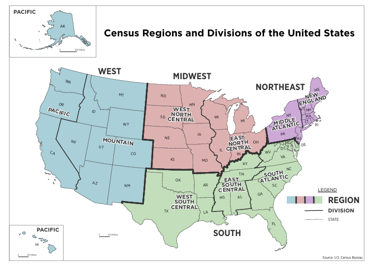
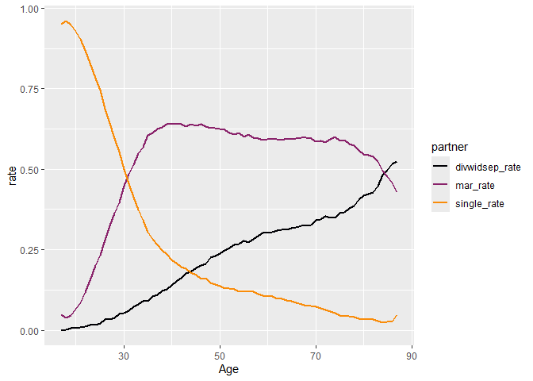
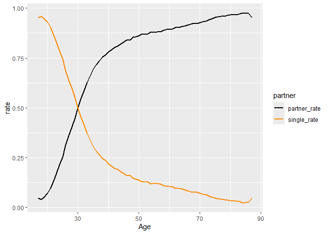
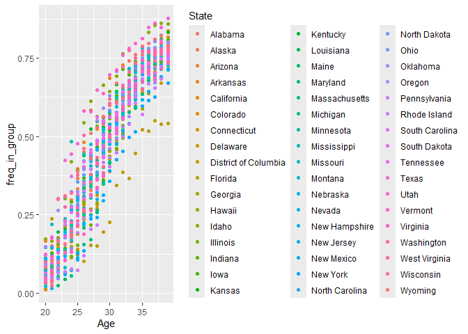

Lab 3
================

### Econ B2000, MA Econometrics

### Kevin R Foster, the Colin Powell School at the City College of New York, CUNY

### Fall 2025

We’ll continue with creating some graphs and statistics about
partnering. This is not a class on demography so we’re not doing
anything deep, just using this data to learn about process.

Load the data, same as before – your data is in a different place so
your `setwd` commands will be different. And last time we created a new
variable so do that again.

``` r
library(tidyverse)
library(ggplot2)

# this would be different for you
setwd("..")
setwd("HPS_2020-24")

load("d_HHP2020_24.Rdata")

setwd("..")
setwd("ecob2000_lab3")

d_HHP2020_24$partnered <- (d_HHP2020_24$Mar_Stat == "Married") | 
                      (d_HHP2020_24$Mar_Stat == "widowed") | 
                      (d_HHP2020_24$Mar_Stat == "divorced") |
                      (d_HHP2020_24$Mar_Stat == "separated")
```

Last time we got some use out of the fraction of people who are
partnered by particular ages. I will pick the age 30 to 34 group to
start, let’s look at the fraction of people who are 30-34 in each state
who are partnered.

``` r
d_HHP_Age30_34 <- d_HHP2020_24 %>% filter( ((Age >= 30) & (Age < 35)) & 
                                             !is.na(partnered))

frac_MS_byState <- d_HHP_Age30_34 %>% 
  group_by(State, partnered) %>% 
  summarize( n = n() ) %>% 
  mutate(freq_in_group = n / sum(n) )
```

That compresses a lot of data but it’s still a lot. Perhaps we can group
together some of the states? US government statistical agencies do this
already – and there are variables that I’ve put into the dataset, for
`Census_division` and `Region`.

Here’s a map, showing the 4 big divisions (Northeast, Midwest, South,
and West) along with the divisions – each region has 2 divisions except
the South that has 3.



[Full list from US
Census](https://www2.census.gov/geo/pdfs/maps-data/maps/reference/us_regdiv.pdf).

``` r
frac_MS_byRegion <- d_HHP_Age30_34 %>% 
  group_by(Region, partnered) %>% 
  summarize( n = n() ) %>% 
  mutate(freq_in_group = n / sum(n) )
```

I’ll leave it to you to do it by division.

I haven’t created any graphs yet, although that was what I’d started
asking about. One obvious graph would be to create a map where the
colors correspond to the fraction partnered. That’s not a direction
we’ll go for now – it’s not actually hard to do, but it’s not simple and
would take us a bit afield.

``` r
library(viridis)


HHP_use <- d_HHP2020_24 %>% filter( Age < 88 ) # those are topcoded, so 88 means "88 and older"


partner_rate_sum <- HHP_use %>% group_by(Age) %>% 
  summarize(mar_rate = sum(Mar_Stat == "Married", na.rm = TRUE) / sum(!is.na(Mar_Stat)),
            divwidsep_rate = sum( (Mar_Stat == "divorced") | (Mar_Stat == "separated") | (Mar_Stat == "widowed") , na.rm = TRUE) / sum(!is.na(Mar_Stat)),
            single_rate = sum(Mar_Stat == "never", na.rm = TRUE) / sum(!is.na(Mar_Stat)),
            number_obs = n()                                                           )


partner_for_graph1 <- partner_rate_sum %>% 
  select(-number_obs) %>%
  pivot_longer(!Age, names_to = "partner", values_to = "rate")

ggplot(partner_for_graph1, aes(x=Age, y = rate, colour = partner)) + 
  geom_line(linewidth = 1) +
  scale_color_viridis_d(option = "inferno", end = 0.75) 
```

<!-- -->

To note, I split the analysis from the graphing. Those could have been
done in one big step but I think this is a bit easier to understand and
poke into. (Those latter two verbs being synonyms.)

The graph shows that the fraction who are married rises at a steady rate
until around age 35, when the slope really breaks. In the next lab we’ll
be drawing lines so it’s worth noticing.

``` r
partner_for_graph2 <- partner_rate_sum %>% 
  mutate(partner_rate = mar_rate + divwidsep_rate) %>%
  select(-c("mar_rate","divwidsep_rate","number_obs")) %>%
  pivot_longer(!Age, names_to = "partner", values_to = "rate")

ggplot(partner_for_graph2, aes(x=Age, y = rate, colour = partner)) + 
  geom_line(linewidth = 1) +
  scale_color_viridis_d(option = "inferno", end = 0.75) 
```

<!-- -->

The good part about this is that the 2 numbers must add up to one; the
bad part is that because of that fact, one of the lines is just
duplicate information. Which isn’t necessarily wrong, sometimes a bit of
duplication can be helpful. It can be a good idea to repeat yourself.
(See what I did there?) But not always, YMMV.

The sharp break in the slope of the line, for married, is now a bit
smoother if we combine into once-or-currently partnered.

If we want to put these together, how about a scatterplot with Age on
the horizontal, fraction partnered on vertical, per state?

Calculate the fractions,

``` r
d_HHP_Age20_39 <- d_HHP2020_24 %>% filter( ((Age >= 20) & (Age < 40)) & 
                                             !is.na(partnered))

frac_partner_byState <- d_HHP_Age20_39 %>% 
  group_by(Age, State, partnered) %>% 
  summarize( n = n() ) %>% 
  mutate(freq_in_group = n / sum(n) )

# we only need the fraction partnered
frac_partner_byState <- frac_partner_byState %>% filter(partnered == TRUE)
```

Then graph.

``` r
p3 <- ggplot(data = frac_partner_byState, aes(x = Age, y = freq_in_group, colour = State))

p3 + geom_point()
```

<!-- -->

That’s a lot of dots. More space goes for the labels than for the actual
graph, yikes! Still, it does give a bit of a sense of where are the real
outliers.

You should be able to make graphs by region and division. You might try
multiple plots, maybe 4 plots of each of the regions, where states are
separated within each region. Or division.

Next try if you subdivided by particular groups: do you think people
with college degrees pair up at a higher rate? (Although note that not
many people under 23 or so even have a degree, so you might start from a
higher age.) What about other demographic characteristics? What if you
divided by gender or race or ethnicity? Try and see!
